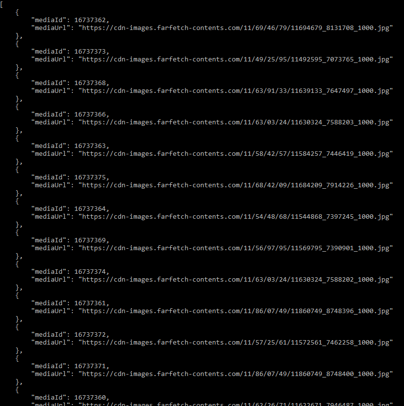

ScopeMedia Python Demo - Similar Image Search
=====
An example showing how Similar Image Search API is used.

Installation and System Requirements
-----
Clone this repository or download **api_demo.py**. You need to install Python 2.7 and [Requests](http://docs.python-requests.org/) module in order to run the demo.

Usage
-----
This project uses a demo account's image set, which has 200 fashion images. You can input an image URL or image file to search similar images in the image set.

To use your image set, edit **api_demo.py** and replace the value of clientId and clientSecret with your application's credentials from [dashboard](https://api.scopemedia.com/#/dashboard/products/ScopeCheck/feature).

Help:
```
python api_demo.py -h
```

Search by URL:
```
python api_demo.py -u http://example.com/example.jpg
```

Search by image file:
```
python api_demo.py -u example.jpg
```

The search result will be output as a list of medias, which has it's ID and URL.

Screenshot
-----


Links
-----
* [ScopeMedia API](https://developer.scopemedia.com/documentation/)
